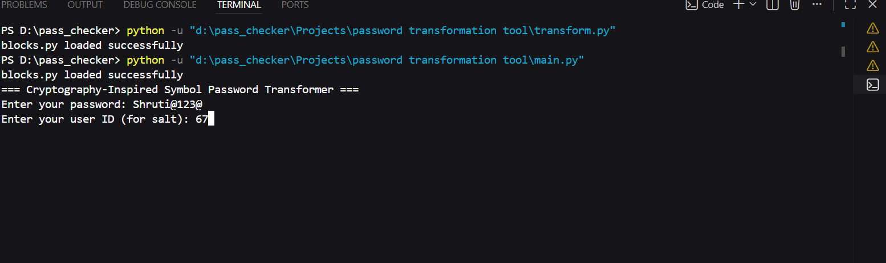
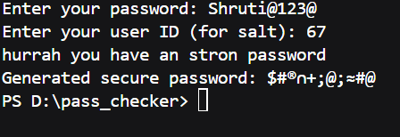

# password Transformation Tool(Cryptography inspired)
# overview
This project is a Python-based password transformation tool designed to simulate core cybersecurity concepts such as salting, hashing, and secure password representation. It demonstrates how passwords can be transformed into non-reversible secure outputs using cryptographic principles.

## Features
-Password input with user id
- SHA-256 hashing mechanism
- Symbol-based password transformation
- Strength validation logic
- No plaintext password storage
- Terminal-based interactive executon

## Security Concepts Implemented
- Salting to prevent rainbow table attacks
- One-way cryptographic hashing(SHA-256)
- Data transformation inspired by cipher diffusion 
- OWASP password policy principles
---
## working Demo 
 ### Input
 
 ### Output

---

---

## 💻 Technologies Used
- Python 3
- hashlib (SHA-256)
- Basic cryptographic logic
- String manipulation techniques

---

## Purpose
This project is built for learning cybersecurity and cryptography concepts.
It is not intended to replace standard password hashing libraries in production.
